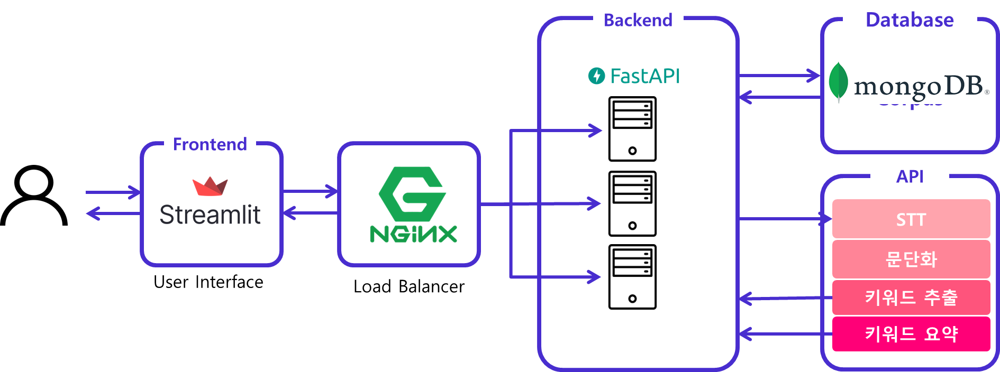
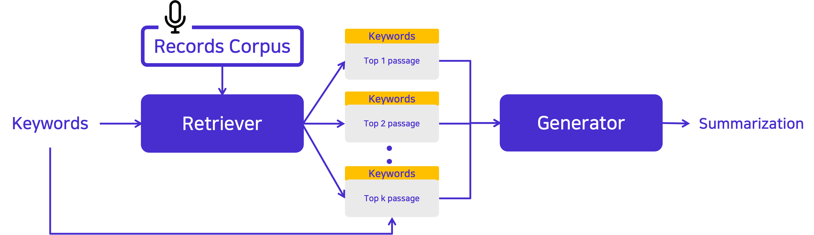

<a name="readme-top"></a>
<p align="center">
    <a href="https://github.com/boostcampaitech4lv23nlp2/final-project-level3-nlp-10/blob/master/LICENSE">
        
    </a>
    <a href="https://github.com/boostcampaitech4lv23nlp2/final-project-level3-nlp-10/issues">
        
    </a>
    
</p>
<!-- PROJECT LOGO -->
<br />
<div align="center">
  <a href="https://github.com/boostcampaitech4lv23nlp2/final-project-level3-nlp-10">
    
  </a>

  <h2 align="center">Boost2Note</h2> 
  <p align="center">
    회의 음성 기록을 키워드별 요약으로 보다 기록 관리를 편리하게! 
    <br />
    <a href="https://gray-margin-3b9.notion.site/Wrap-up-Report-99a61038590a4966ada733bd5947974e">Explore the docs(Notion)</a>
    ·
    <a href="https://www.youtube.com/watch?v=JBFoHI7DOtg">Presentation(Youtube)</a>  
    ·
    <a href="http://115.85.180.71:30001">View Demo</a>
    ·
    <a href="https://github.com/boostcampaitech4lv23nlp2/final-project-level3-nlp-10/issues">Report Bug</a>
    
    
  </p>
  
  <p align="center">
       
 
  </p>
  
</div>


# **Boost2Note Demo**


# Members
<p align="center">

|김산|엄주언|이동찬|이정현|
|:---:|:---:|:---:|:---:|
|||||
|<a href="https://github.com/mountinyy"></a>|<a href="https://github.com/EJueon"></a>|<a href="https://github.com/donggrii"></a>|<a href="https://github.com/Jlnus"></a>|
  
</p>

# Why **Boost2Note?**
💬 많은 사람들이 사용하는 **음성 녹음 기록 노트**. 하지만 길어질수록 다시 듣기가 어렵습니다.

💬 타임라인 별 요약은 누락된 부분이 많아 결국 사용자는 **전체 스크립트를 볼 수 밖에 없다**는 단점이 있습니다.

💬 만약 **음성 기록을 원하는 키워드 별로 요약해주는 서비스**가 있다면? 음성 기록을 관리하는데 훨씬 편하지 않을까요?

💬 저희 Boost2End의 비행사들은 보다 편한 음성 녹음 기록을 위하여 **비행**을 시작하였습니다.


# What is Boost2Note?
`Boost2Note`는 업로드한 녹음본에 대하여 키워드를 입력하면 저장된 녹음 기록으로부터 키워드와 관련된 문단을 추출 요약하여 서비스를 제공합니다. 
<p align="center">
   
</p>


# How to Use?

frontend 서버 실행
```
streamlit run Boost2Note.py
```

backend 서버 실행 
```
python server.py
```

nginx 실행
```
sudo nginx
```
- nginx 설치 및 설정 방법 : [Issue #38](https://github.com/boostcampaitech4lv23nlp2/final-project-level3-nlp-10/issues/38)
# Structure of Boost2Note

## Project Structure

```
├─ app
│  ├─ frontend
│  │  ├─ Boost2Note.py
│  │  └─ pages
│  │     └─ Total_Note.py
│  └─ backend
│     ├─ config.yaml
│     ├─ server.py
│     └─ app_utils
│        ├─ __init__.py
│        ├─ cache_load.py
│        ├─ data_process.py
│        ├─ extract_keyword.py
│        ├─ key_bert.py
│        ├─ stt.py
│        └─ inference.py
├─ ml
│ ├─ config
│ ├─  model
│ │   ├─ __init__.py
│ │   └─ retrieval.py
│ └─  utils
└─ notebooks
```

## Service Structure
<div align="center">
<p align="center">
   
</p>
</div>

## Dataset Structure
💬 저희 `Boost2Note`는 키워드 별 요약 시스템을 제작하기 위하여 여러 데이터셋으로부터 데이터 72,623개 (train: 65,323 / dev: 7,300) 를 수집하였으며 수집된 데이터에서 키워드를 추출하는 방식으로 키워드 요약 데이터셋을 생성하였습니다. 

💬 사용된 데이터셋은 다음과 같습니다. 

|Dataset 종류|
|:---|
|AI 기반 회의 녹취록 요약 경진 대회 회의 녹취록 데이터셋|
|요약문 및 레포트 생성 데이터 :: 연설|
|방송 콘텐츠 대본 요약 데이터 :: 시사, 예능|

</br>


## Model Structure
<div align="center">
<p align="center">
   
</p>
</div>

💬 저희 `Boost2Note`에는 음성 기록의 키워드 별 요약 시스템을 제작하기 위하여 `RAG Architecture`[1][2]을 사용합니다. 

💬 `RAG Architecture`는 top k passage를 각각 요약하지 않고 모두 참조하여 하나의 요약을 생성한다는 점이 보다 저희에게 적합한 task입니다.

💬 그 기반이 되는 `klue/bert-base` 기반 DPR retriever를 학습하였고 대화 요약 데이터셋으로 학습된 `alaggung/bart-r3f` 모델을 사용하였습니다.

💬 `RAG Architecture` 모델은 RAG[1]와 FiD[2]를 사용하여 구현하였으며 키워드 요약 데이터셋을 학습하였습니다. 

💬 결과적으로 FiD[2]를 선택하여 서비스를 구성하였습니다.

</br>

###  ⚗️ Retriever 학습 결과

<!-- 실험(적용) 과정과 결과 -->
|Retriever(%)|top5 ACC|top10 ACC|
|:---|---:|---:|
|TF-IDF|66.86|79.69|
|DPR|89.63|93.89|

</br>

###  ⚗️ 키워드 요약 모델 학습 결과
|keyword-summarization|cosine similarity|ROUGE-1(F1)|ROUGE-2(F1)|ROUGE-L(F1)|
|:---|---:|---:|---:|---:|
|KoBART 단순 요약|0.683|0.206|0.106|0.196|
|KoBART 단순 요약|0.651|0.191|0.098|0.182|
|RAG top 5 키워드 요약|0.492|0.164|0.068|0.156|
|**FiD top 10 키워드 요약**|**0.727**|**0.184**|**0.046**|**0.184**|


</br>

## Reference
[1] Lewis, Patrick, et al. "Retrieval-augmented generation for knowledge-intensive nlp tasks." Advances in Neural Information Processing Systems 33 (2020): 9459-9474.

[2] Izacard et al. "Leveraging passage retrieval with generative models for open domain question answering." arXiv preprint arXiv:2007.01282 (2020).
